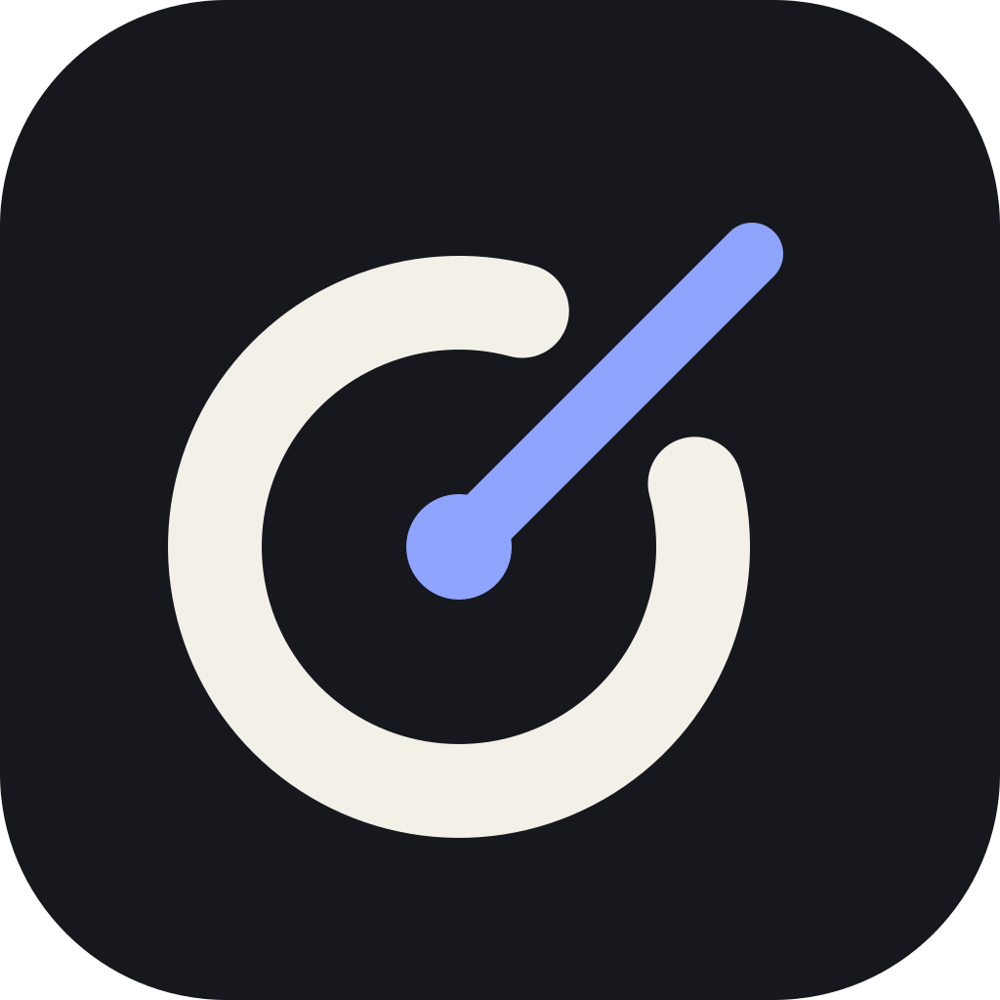

<p align="center"></p>

# Conductor

An open-source, local-first workspace for AI-assisted development. Choose a model or reusable Combo, work with a project, and keep context, permissions and verification visible. No Conductor account.

**Development status:** Conductor is being built against the [full product specification](docs/CONDUCTOR_MASTER_BUILD_PROMPT.md). It is not yet a verified v1 release. The [implementation audit](docs/IMPLEMENTATION_AUDIT.md) preserves every requirement; the [verification record](docs/VERIFICATION.md) distinguishes passing checks from work still unverified.

## Build from source

Requirements: Git, a current stable Rust toolchain, Node.js 22 or newer with npm, and the [Tauri desktop prerequisites](https://v2.tauri.app/start/prerequisites/). Windows needs the Visual Studio C++ build tools and WebView2. Linux needs WebKitGTK 4.1 and native development libraries. macOS needs Xcode command-line tools.

```sh
git clone https://github.com/BenjiSyS/Conductor.git
cd Conductor
npm ci
npm run desktop
```

Create an unsigned development package without updater signing keys:

```sh
npx tauri build --config .github/unsigned-tauri.json -- --locked
```

Run the headless CLI:

```sh
cargo run -p conductor-cli -- --help
cargo run -p conductor-cli -- doctor
cargo run -p conductor-cli -- context . "explain provider streaming" --json
```

Production packaging uses `npm run desktop:build` and requires the configured updater signing key. OS signing and notarization require separate credentials. See [release gates](docs/RELEASES.md).

The browser development server (`npm run dev`, http://127.0.0.1:1420) is for frontend development. Native project, credential and orchestration operations require the desktop application. Browser fixtures are not proof of native provider authentication.

## First use

1. Choose a performance profile in setup, or configure it later.
2. Connect a provider with an API key through Settings. Keys use OS credential storage, with no plaintext fallback.
3. Open a project folder.
4. Choose an available model or Combo and an effort supported by that model.
5. Send a request. Use Stop to cancel; the emergency shortcut is configurable in the desktop application.

Provider requests send the selected prompt and context to that provider. Review the Context Inspector and [privacy documentation](docs/PRIVACY.md). Secret detection reduces exposure but cannot identify every possible secret.

Provider API adapters cover OpenAI, Anthropic, Google Gemini and OpenAI-compatible endpoints. Protocol fixtures and deterministic checks are separate from live API-key tests. OAuth and subscription integrations require official support and successful end-to-end evidence before they can be advertised. See [provider adapters and authentication](docs/PROVIDERS.md).

## Working concepts

- **Chat / Plan / Agent / Goal:** questions, planning, permitted tools and outcome-oriented orchestration. A Goal completes only after its configured acceptance checks.
- **Combos:** reusable model roles, routing, reserves and fallback policy; providers are not permanently tied to a role.
- **Context:** selected repository data, hash-keyed cache, compression, estimated token budget and inspectable handoff packets.
- **Permissions:** Ask, Auto Approve and Full Access. Full Access does not bypass path or download integrity checks.
- **History:** meaningful decisions, handoffs and verification. Checkpoints preserve project work before risky changes.
- **Background / resume:** the desktop lifecycle and durable Goal state support continuation; native lifecycle verification remains a release gate.

These are product concepts, not a blanket claim that every integration has passed release validation. Current evidence is recorded per requirement.

## Extend and contribute

[MCP](docs/MCP.md) · [Skills and plugins](docs/EXTENSIONS.md) · [Create a theme](docs/THEMES.md) · [Architecture](docs/ARCHITECTURE.md) · [Security](SECURITY.md) · [Contributing](CONTRIBUTING.md) · [Releases](docs/RELEASES.md)

Community themes use a validated `theme.json` data format. Start with [the theme template](examples/theme/theme.json), install the local folder in Appearance settings, and preview both light and dark variants. See the dedicated theme guide for packaging, versioning and trust.

No mandatory cloud registration, forced telemetry, Quiet Mode, community template marketplace or provider lock-in.

MIT license. Third-party components retain their own licenses. Redistribution and signing checks remain part of release readiness.
